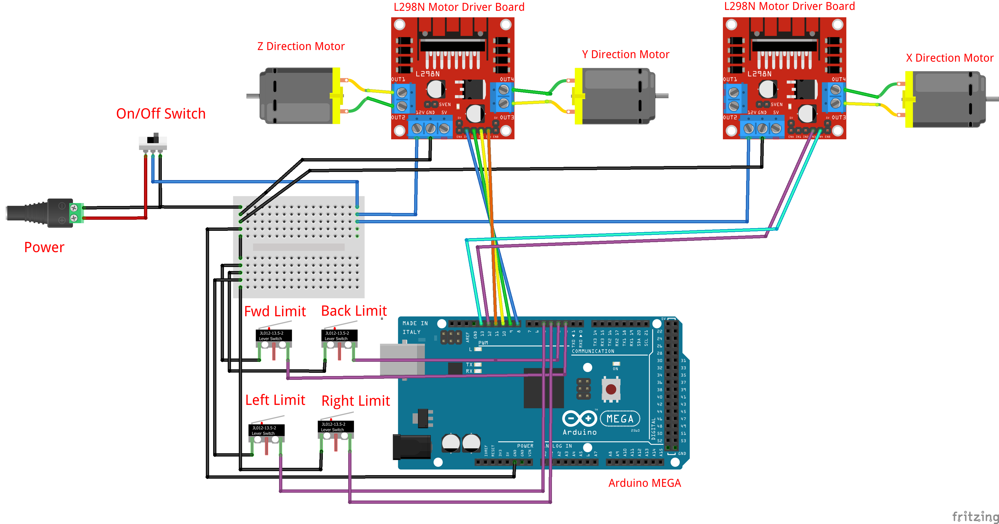

# TwitchPlays Crane Game

An Arduino-powered retrofit of a toy crane game that can be controlled via messages from a live streaming chat.

## Project Goal

The goal of this project was to take a crane game and rebuild it into a chat-controlled interactive device for live streams. Python script that handles chat messages is triggered by a by a broadcast automation tool, such as Streamer.bot or Mix It Up. Python script was forked from dougdoug and changed to send serial commands to the arduino instead of controlling the mouse and keyboard. The Arduino recieves the serial commands and moves the claw allowing chat to play the crane game.

## Instructions

To run the code you will need to install Python 3.9.  
Additionally, you will need to install the following python modules using Pip:  
python -m pip install keyboard  
python -m pip install pydirectinput  
python -m pip install pyautogui  
python -m pip install pynput  
python -m pip install requests  

Once Python is set up, simply change the Twitch username (or Youtube channel ID) in TwitchPlays_CraneGame.py

Additionally you will need to wire up your crane (see wiring diagram) and upload the firmware to your arduino board

## How It Works

1. A viewer redeems a channel redemption in the live stream chat.
2. A broadcast automation tool recognizes the channel redemption and triggers the python control script.
4. The Python script opens a serial connection to the Arduino and waits from inputs from chat.
5. Once the chat attempts a "Grab" command the claw will decend and move to the origin.
6. Python script exits

## Hardware Used

- Arduino Mega
- 2x L298N motor driver board
- Toy Crane Game
- Perma Proto Board

## Wiring Diagram

## Credit

This code is originally based off Wituz's Twitch Plays template, then expanded by DougDoug and DDarknut with help from Ottomated for the Youtube side.
